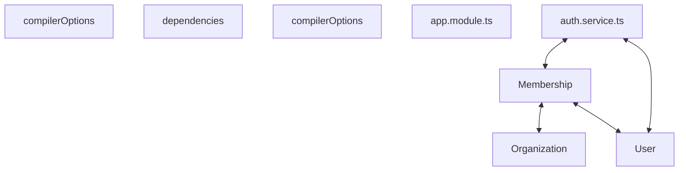

# Codebase Architectural Report

> **Auto-generated** by graphify knowledge graph analysis  
> **Purpose**: Dependency map, connection analysis, subsystem breakdown, and quality hotspots.

---

## 1. Executive Summary

- **Total Components**: `387`
- **Total Connections**: `560`
- **Subsystem Modules**: `1`
- **Dependency Types**: `8`

**Key Architectural Hubs:**

| # | Component | File | Type | Connections |
|---|-----------|------|------|-------------|
| 1 | `User` | `backend/src/modules/users/user.entity.ts` | class | 22 |
| 2 | `Membership` | `backend/src/modules/organizations/membership.entity.ts` | class | 21 |
| 3 | `Organization` | `backend/src/modules/organizations/organization.entity.ts` | class | 21 |
| 4 | `compilerOptions` | `backend/tsconfig.json` | function | 21 |
| 5 | `dependencies` | `backend/package.json` | function | 18 |
| 6 | `compilerOptions` | `frontend/tsconfig.json` | function | 18 |
| 7 | `app.module.ts` | `backend/src/app.module.ts` | file | 17 |
| 8 | `auth.service.ts` | `backend/src/modules/auth/auth.service.ts` | file | 17 |

---

## 2. Dependency & Connection Analysis

### Relationship Types

| Relationship | Count | Share |
|-------------|-------|-------|
| `contains` | 186 | 33% |
| `imports` | 141 | 25% |
| `references` | 93 | 17% |
| `imports_from` | 82 | 15% |
| `method` | 29 | 5% |
| `calls` | 17 | 3% |
| `extends` | 11 | 2% |
| `shares_data_with` | 1 | 0% |

### Hub Dependency Diagram

### Most Connected Pairs

| Component A | Component B | Shared Connections |
|-------------|-------------|-------------------|
| `.constructor()` | `AuthService` | 3 |
| `.constructor()` | `InjectRepository` | 3 |
| `build` | `scripts` | 2 |
| `dev` | `scripts` | 2 |
| `scripts` | `test` | 2 |
| `devDependencies` | `typescript` | 2 |
| `typescript` | `typescript` | 2 |
| `.constructor()` | `Membership` | 2 |
| `.constructor()` | `User` | 2 |
| `.list()` | `OrganizationType` | 2 |

---

## 3. Subsystem & Module Breakdown

### 3.1 backend/src
**Nodes**: `387`  
**Files**: `.engine/memory/progress_summary.md`, `backend/nest-cli.json`, `backend/package.json`, `backend/src/app.module.ts`, `backend/src/common/decorators/current-user.decorator.ts`, `backend/src/common/decorators/roles.decorator.ts` +46 more

| Component | Type | File | Connections |
|-----------|------|------|-------------|
| `User` | class | `backend/src/modules/users/user.entity.ts` | 22 |
| `Membership` | class | `backend/src/modules/organizations/membership.entity.ts` | 21 |
| `Organization` | class | `backend/src/modules/organizations/organization.entity.ts` | 21 |
| `compilerOptions` | function | `backend/tsconfig.json` | 21 |
| `dependencies` | function | `backend/package.json` | 18 |
| `compilerOptions` | function | `frontend/tsconfig.json` | 18 |
| `app.module.ts` | file | `backend/src/app.module.ts` | 17 |
| `auth.service.ts` | file | `backend/src/modules/auth/auth.service.ts` | 17 |
| `AuthContext.tsx` | class | `frontend/src/auth/AuthContext.tsx` | 17 |
| `membership.entity.ts` | file | `backend/src/modules/organizations/membership.entity.ts` | 16 |

---

## 4. API Reference

Public classes and functions by subsystem.

### backend/src

| Name | Type | File | Connections |
|------|------|------|-------------|
| `User` | class | `backend/src/modules/users/user.entity.ts` | 22 |
| `Membership` | class | `backend/src/modules/organizations/membership.entity.ts` | 21 |
| `Organization` | class | `backend/src/modules/organizations/organization.entity.ts` | 21 |
| `compilerOptions` | function | `backend/tsconfig.json` | 21 |
| `dependencies` | function | `backend/package.json` | 18 |
| `compilerOptions` | function | `frontend/tsconfig.json` | 18 |
| `AuthContext.tsx` | class | `frontend/src/auth/AuthContext.tsx` | 17 |
| `devDependencies` | function | `backend/package.json` | 15 |

---

## 5. Code Quality & Architectural Risk Hotspots

### Component Type Distribution

| Type | Count | Share |
|------|-------|-------|
| function | 179 | 46% |
| class | 122 | 32% |
| method | 46 | 12% |
| file | 40 | 10% |

### High-Connectivity Hotspots

**10** component(s) with >15 connections:

| Component | File | Connections |
|-----------|------|-------------|
| `User` | `backend/src/modules/users/user.entity.ts` | 22 |
| `Membership` | `backend/src/modules/organizations/membership.entity.ts` | 21 |
| `Organization` | `backend/src/modules/organizations/organization.entity.ts` | 21 |
| `compilerOptions` | `backend/tsconfig.json` | 21 |
| `dependencies` | `backend/package.json` | 18 |
| `compilerOptions` | `frontend/tsconfig.json` | 18 |
| `app.module.ts` | `backend/src/app.module.ts` | 17 |
| `auth.service.ts` | `backend/src/modules/auth/auth.service.ts` | 17 |
| `AuthContext.tsx` | `frontend/src/auth/AuthContext.tsx` | 17 |
| `membership.entity.ts` | `backend/src/modules/organizations/membership.entity.ts` | 16 |

### Dependency Cycles

**192** circular dependency loop(s) detected:

| # | Cycle Path |
|---|-----------|
| 1 | `frontend_src_api_auth → frontend_src_types_index_loginresponse → frontend_src_types_index` |
| 2 | `frontend_src_api_auth → frontend_src_types_index_authprincipal → frontend_src_types_index` |
| 3 | `frontend_src_auth_authcontext → frontend_src_types_index_authprincipal → frontend_src_types_index` |
| 4 | `frontend_src_auth_authcontext → frontend_src_auth_authcontext_authcontextvalue → frontend_src_types_index_authprincipal` |
| 5 | `frontend_src_api_auth → frontend_src_auth_authcontext → frontend_src_types_index` |
| 6 | `frontend_src_auth_authcontext_useauth → frontend_src_features_landing_landingpage → frontend_src_auth_authcontext` |
| 7 | `frontend_src_app → frontend_src_router → frontend_src_features_landing_landingpage → frontend_src_auth_authcontext` |
| 8 | `frontend_src_auth_protectedroute → frontend_src_router → frontend_src_features_landing_landingpage → frontend_src_auth_authcontext` |
| 9 | `frontend_src_features_auth_loginpage → frontend_src_router → frontend_src_features_landing_landingpage → frontend_src_auth_authcontext` |
| 10 | `frontend_src_features_home_homepage → frontend_src_router → frontend_src_features_landing_landingpage → frontend_src_auth_authcontext` |

### Orphaned Components

**13** isolated node(s) with no connections:

| Component | File |
|-----------|------|
| `auth.spec.ts` | `e2e/auth.spec.ts` |
| `vite-env.d.ts` | `frontend/src/vite-env.d.ts` |
| `vite.config.ts` | `frontend/vite.config.ts` |
| `vitest.config.ts` | `frontend/vitest.config.ts` |
| `Planning Phase Summary` | `.engine/memory/progress_summary.md` |
| `Todo: site-config (pending)` | `todos.yaml` |
| `Todo: appointment-booking (pending)` | `todos.yaml` |
| `Todo: coordinator-queue (pending)` | `todos.yaml` |
| `Todo: live-board (pending)` | `todos.yaml` |
| `Todo: gate-visits (pending)` | `todos.yaml` |

---

## 6. How to Navigate

1. **Interactive D3 Map** — open `graph.html` to explore node connections visually.
2. **Knowledge Graph Queries** — use MCP tools (`graph_query`, `graph_explain_node`, `graph_impact_radius`).
